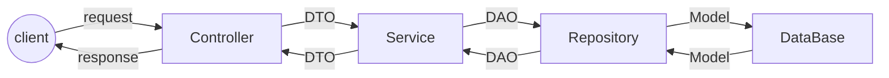

## Spring
**تعریف :** 
در جاوا از این فریمورک برای توسعه راحتتر برنامه ها استفاده میشود که این فریمورک شامل چند فریمورک بوده که در ادامه به توضیح آنها خواهیم پرداخت.

**Spring MVC :**
از این فریمورک برای پیاده سازی معماری MVC(model, view, controller) استفاده میکنیم و برعکس Spring Boot باید تنظیمات بیشتری انجام شود تا اپلیکیشن به مرحله توسعه برسد.

**Spring Security :**
از این فریمورک برای اضافه کردن ویژگی های امنیتی از قبیل Authenication و Authorization و ... استفاده میشود

**Spring Boot :**
از این فریمورک برای توسعه وب اپلیکیشن هایی که میخواهیم سریعا به مرحله استقرار و استفاده برسند استفاده میکنیم.
برای استفاده از Spring Boot از Annotation ها استفاده میشود به طور مثال برای اجرای برنامه میتوان یک فایل در ریشه برنامه ساخته و توسط کلید واژه های  @SpringBootApplication و یا @ComponentScan و @EnableAutoConfiguration و @Configuration   برنامه را اجرا میکنیم.

**@SpringBootApplication vs @ComponentScan & @EnableAutoConfiguration & @Configuration :**
از @ComponentScan برای اسکن کردن پروژه Spring و پیدا کردن کامپوننت های برنامه استفاده میشود و از @EnableAutoConfiguration به منظور پیکربندی و تنظیم کردن Bean های موجود در classpath پروژه استفاده میشود و از  @Configuration برای مشخص کردن کلاس هایی که به منظور پیکربندی پروژه ساخته میشوند استفاده میشود در حالی که میتوان کاری که سه کلید واژه قبلی انجام میدهند را با @SpringBootApplication انجام داد.

نکته : برای اجرای یک برنامه Spring معمولا از @SpringBootApplication استفاده میکنیم.
نکته : در Spring Boot از Dependency Injection استفاده میشود که در ادامه توضیح داده میشود.

## اجرای یک برنامه Spring Boot :‍
برای توسعه یک پروژه Spring Boot در اینجا از ابزار ساخت پروژه maven استفاده میکنیم.
در ابتدا باید Spring Boot را به فایل pom.xml اضافه کنیم.
```
<?xml version="1.0" encoding="UTF-8"?>  
<project xmlns="http://maven.apache.org/POM/4.0.0" xmlns:xsi="http://www.w3.org/2001/XMLSchema-instance"  
xsi:schemaLocation="http://maven.apache.org/POM/4.0.0 https://maven.apache.org/xsd/maven-4.0.0.xsd">  
	<modelVersion>4.0.0</modelVersion>  
	<parent> 
		<groupId>org.springframework.boot</groupId>  
		<artifactId>spring-boot-starter-parent</artifactId>  
		<version>2.4.1</version>  
		<relativePath/> <!-- lookup parent from com.example.repository -->  
	</parent>  
	<groupId>com.example</groupId>  
	<artifactId>demo</artifactId>  
	<version>0.0.1-SNAPSHOT</version>  
	<name>demo</name>  
	<description>Demo project for Spring Boot</description>  

	<properties> 
		<java.version>1.8</java.version>  
	</properties>    
	<dependencies>  

	<dependency> 
		<groupId>org.springframework.boot</groupId>  
		<artifactId>spring-boot-starter-web</artifactId>  
	</dependency>  
	<dependency> 
		<groupId>org.springframework.boot</groupId>  
		<artifactId>spring-boot-starter-test</artifactId>  
		<scope>test</scope>  
	</dependency>  
	<dependency> 
		<groupId>org.springframework.boot</groupId>  
		<artifactId>spring-boot-starter-data-jpa</artifactId>  
	</dependency>  
	<dependency> 
		<groupId>org.mariadb.jdbc</groupId>  
		<artifactId>mariadb-java-client</artifactId>  
	</dependency>  

	</dependencies>
</project>
```
**<parent>:**
در فایل pom.xml برای هیچ کدام از dependency ها version مشخص نکردیم چون ممکن است ورژن مشخص شده توسط ما با نسخه Spring Boot مورد استفاده همخوانی نداشته باشد. برای راحتی کار از تگ parent استفاده کردیم خود maven وظیفه هماهنگی نسخه ها را بر عهده داشته و بر اساس نسخه مشخص شده در تگ parent نسخه dependency ها را مدیریت کرده و دیگر نیازی به تنظیمات از طرف برنامه نویس نخواهد بود.

نکته : 
پس از اضافه کردن Spring Boot به پروژه با ساختن یک فایل جاوا در ریشه برنامه بطور مثال (spring boot/src/main/java/com/example/SpringBootApplication.java)

که به صورت زیر یک متد main داشته و برنامه ما در آن اجرا میشود میتوان پروژه را اجرا کرد.
نکته : با اجرا برنامه در این مرحله به ارور برخورد میکنیم چون در فایل controller هیچ مسیری برای پردازش توسط برنامه مشخص نکرده ایم.
```
import org.springframework.boot.SpringApplication;
import org.springframework.boot.autoconfigure.SpringBootApplication;

@SpringBootApplication
public class SpringBootApplication {

    public static void main(String[] args) {
        SpringApplication.run(SpringBootAplication.class, args);
    }

}
```
**نحوه کار Spring Boot**



## Dependency Injection 
وقتی یک پروژه Spring Boot اجرا میشود از تمامی کلاس هایی که با کلیدواژه @Component علامتگذاری شده اند در Spring Container یک نمونه میسازد . برای دسترسی به این کلاس ها به کلاس هایی که میخواهیم در آنها از نمونه ساخته شده استفاده کنیم باید این دو کلاس را به هم متصل (سیم کشی) کنیم.
برای متصل کردن این دو کلاس به هم باید یک متغیر از کلاس مورد نظر ساخته و بالای آن از کلید واژه @Autowired استفاده کنیم.
```
@Autowired
HelloWorld helloWorld;
```
نکته : برای اتصال این دو کلاس به هم میتوان از Constructor کلاسی که در آن هستیم استفاده کنیم.
```
public TestHelloWorld(HelloWorld helloWorld){
	this.helloWorld = helloWorld;
	}
```
 به عملیات اتصال این دو کلاس Dependency Injection گفته میشود.
## کلاس های Spring:
**1.Controller :**
Controller ها وظیفه دریافت درخواست ها از سمت کاربر و dispatch کردن آنها به Service های مشخص شده 

**Annotations :**

 1. @Controller : این کلید واژه میگوید کلاس مورد نظر یک Controller است که با view ها کار میکند

 2. @RestController : این کلید واژه میگوید Controller مورد نظر فایل JSON بر میگرداند.

 3. @RequestMapping : برای مشخص کردن اینکه کدام URL مختص این کنترلر است استفاده میشود
نکته : برای اختصاص یک URL به کنترلر مربوطه میتوان از این کلیدواژه در ابتدای کنترلر استفاده کرد.
نکته : میتوان نوع درخواستی که باید توسط متد مورد نظر پاسخ داده میشود را به صورت زیر مشخص کرد
```
	@RequestMapping(method = RequestMethod.POST , value = "/anything")
	public save(MyDTO dto){...}
```
4. @GetMapping : همان @RequestMapping است با این تفاوت که method آن به صورت GET مقداردهی شده است

5. @PostMapping : همان @RequestMapping است با این تفاوت که method آن به صورت POST مقداردهی شده است

6. @PutMapping : همان @RequestMapping است با این تفاوت که method آن به صورت PUT مقداردهی شده است

7. @DeleteMapping : همان @RequestMapping است با این تفاوت که method آن به صورت DELETE مقداردهی شده است

8.  @RequestParam : قبل از هر متغیری بیاید یعنی این متغیر از سمت request دریافت شود.
مثال : localhost:8080/test?id=1

9. @PathVariable : مثل بالایی با این تفاوت که متغیر از URL دریافت میشود.
مثال : localhost:8080/test/{id}

10. @RequestBody : این کلیدواژه بنده درخواست http را بر روی متغیر مورد نظر نگاشت میکند ، از این کلیدواژه معمولا برای کار با JSON استفاده میشود

**نکته:** بهتر است برای دریافت متغیر ها از URL از @RequestParam استفاده شود چون برای ارسال اطلاعات توسط @PathVariable باید از / استفاده کرد و در صورت استفاده از این نوع متغیر دیگر نمیتوان از / @RequestMapping اضافه تر به این URL اختصاص داد

```
package com.example.controller;  
  
import com.example.dto.MyDTO;  
import com.example.service.InterfaceUserService;  
import org.springframework.web.bind.annotation.*;  
  
import java.util.List;  
  
@RestController  
@RequestMapping("/interface")  
public class InterfaceController {  
	private final InterfaceUserService interfaceUserService;  

	public InterfaceController(InterfaceUserService interfaceUserService) {  
		this.interfaceUserService = interfaceUserService;  
	}  
  
	@RequestMapping(method = RequestMethod.POST, path = "/save") 
	public List<MyDTO> saveUser(@RequestBody MyDTO dto){  
		return interfaceUserService.saveUser(dto);  
	}  
  
	@RequestMapping(method = RequestMethod.GET, path = "/get")  
	public MyDTO getUser(@RequestParam Integer id){  
		return interfaceUserService.getUser(id);  
	}  
  
	@RequestMapping(method = RequestMethod.GET, path = "/getusers")  
	public List<MyDTO> getAllUsers(){  
		return interfaceUserService.getAllUsers();  
	}  
  
  
	@RequestMapping(method = RequestMethod.DELETE, path = "/delete")  
	public void deleteUser(@RequestParam Integer id){  
		interfaceUserService.deleteUser(id);  
	}  
  
	@RequestMapping(method = RequestMethod.PUT, value = "/update/{id}")  
	public void updateUser(@PathVariable Integer id,MyDTO dto){  
		interfaceUserService.updateUser(id, dto);  
	}   
}
```
نکته : هنگام استفاده از Mapping ها استفاده از value و path با هم تفاوتی ندارند و میتوان از هر دو استفاده کرد.

**2.Service**
این کلاس وظیفه پردازش داده ها را داشته و در کل اصلی ترین اتفاقات در اپلیکشن در این کلاس رخ میدهد.نقطه مشترک بین Controller(UI) و Repository(DB) بوده و DAO را به DTO تبدیل کرده و بالعکس

@Service : مشخص میکند که کلاس مورد نظر یک Service است.

```
import com.example.model.User;  
import com.example.repository.ClassRepository;  
import org.springframework.stereotype.Service;  
  
import java.util.List;  
import java.util.stream.Collectors;   
  
@Service  
public class ClassUserService {  
  
    private final ClassRepository classRepository;  
 public ClassUserService(ClassRepository classRepository) {  
        this.classRepository = classRepository;  
  }  
  
    public String saveUser(MyDTO dto){  
        return classRepository.save(dtoToDao(dto));  
  }  
  
    public String getUser(Integer id){  
        return daoToDto(classRepository.findById(id));  
  }  
  
  
    public List<String> getAllUsers(){  
        //baraye tabdile liste dao ke az db oomade be liste dto  
 // parallelStream(): methode badi ro be soorate movazi ejra mikone //map(): yek method migire va amaliyat ro rooye hame ye list ejra mikone  return classRepository.findAll().parallelStream().map(this::daoToDto).collect(Collectors.toList());  
  }    
  
    public String deleteUser(Integer id){  
        return classRepository.delete(id);  
  }  
  
    public String updateUser(Integer id, MyDTO dto){  
        return classRepository.update(id, dto);  
  }  
  
    public String daoToDto(MyDAO dao){  
        MyDTO dto = new MyDTO(dao.getFirstName(), dao.getLastName());  
 return dto.toString();  
  }  
  
    public MyDAO dtoToDao(MyDTO dto){  
        return new MyDAO(dto.getFirstName(), dto.getLastName());  
  }  
  
    public MyDAO userToDao(User user){  
        return new MyDAO(user.getFirstName(),user.getLastName());  
  }  
  
    public MyDTO userToDto(User user){  
        return new MyDTO(user.getFirstName(), user.getLastName());  
  }  
}
```

**3.Repository**
این کلاس وظیفه کار با دیتابیس را برعهده داشته و فقط با Service کار میکند
**Annotations**

 1. @Repository : مشخص میکند کلاس مورد نظر یک Repository است 
 
 2. @PersistenceContext : EntityManager را مدیریت میکند و لازم نیست به صورت دستی آن را مدیریت کنیم فقط بعد از استفاده از کلید واژه یک EntityManager تعریف میکنیم.

 3. @Transactional : این کلیدوازه باید قبل از متد هایی بیاید که برروی دیتابیس تغییراتی ایجاد میکند.

نکته : معمولاRepository ها را به صورت یک Interface تعریف میکنیم که از کلاس CrudRepository یا JpaRepository ارث بری میکند. در صورت ارث بری از این کلاس دیگر لازم نیست @Repository استفاده کنیم و علاوه بر آن دیگر نیاز نیست کلاس Repository  را تعریف کنیم و تمامی متد های لازم برای کار با دیتابیس را خواهیم داشت.

```
package com.example.repository;  
  
import com.example.model.User;  
import org.springframework.data.repository.CrudRepository;  
import org.springframework.stereotype.Repository;  
    
public interface InterfaceRepository extends CrudRepository<User, Integer>{  
  
    List<User> findAllByFirstName(String firstName);  
    Optional<User> findById(Integer id);  
}
```

نکته: در صورت استفاده از CrudRepository میتوانیم به صورت زیر Query های دلخواه خود را تعریف کرده و از آنها به صورت متد های تعریف شده در Repository استفاده کنیم.

نکته : همان طور که در کد بالا مشاهده میشود متدی به نام findAllByFirstName() آورده شده که هنگام استفاده از CrudRepository و JpaRepository میتوان از آن ها استفاده کرد تا کار کد نویسی راحت تر شود.
توسعه دهندگان Spring Boot به طور پیشفرض قابلیت تعریف اینگونه متد هارا در هنگام استفاده از این Repository ها قرار داده اند که میتوان فقط با نوشتن نام متد .
تعریف کرد که متد مورد نظر چه نوع رفتاری را از خود نشان دهد


