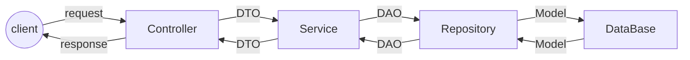

## Spring
**تعریف :** 
از این فریمورک برای توسعه وب اپلیکیشن هایی که میخواهیم سریعا به مرحله استقرار و استفاده برسند استفاده میکنیم.
برای استفاده از Spring Boot از Annotation ها استفاده میشود به طور مثال در فایلی کلاسی که میخواهیم اپلیکیشن در آن اجرا شود از @SpringBootApplication استفاده میکنیم

در Spring Boot از Dependency Injection استفاده میشود که در ادامه توضیح داده میشود.
**Spring MVC :**
از این فریمورک برای پیاده سازی معماری MVC استفاده میکنیم و برعکس Spring Boot باید تنظیمات بیشتری انجام شود تا اپلیکیشن به مرحله توسعه برسد.

**اجرای یک برنامه Spring Boot ;**
برای اجرا باید یک کلاس جاوا در root پروژه ساخته شود و در آن اپلیکشن را به صورت زیر اجرا کرد.
‍
```
import org.springframework.boot.SpringApplication;
import org.springframework.boot.autoconfigure.SpringBootApplication;

@SpringBootApplication
public class SpringBootApplication {

    public static void main(String[] args) {
        SpringApplication.run(SpringBootAplication.class, args);
    }

}
```
**نحوه کار Spring Boot**



## کلاس های Spring:
**1.Controller :**
Controller ها وظیفه دریافت درخواست ها از سمت کاربر و dispatch کردن آنها به Service های مشخص شده 

**Annotations :**

 

 1. @Controller : این کلید واژه میگوید کلاس مورد نظر یک Controller است که با view ها کار میکند

 2. @RestController : این کلید واژه میگوید Controller مورد نظر فایل JSON بر میگرداند.

 3. @RequestMapping : برای مشخص کردن اینکه URL مخصوص به این کنترلر استفاده میشود

 4. @RequestParam : قبل از هر متغیری بیاید یعنی این متغیر از سمت request دریافت شود.
مثال : localhost:8080/test?id=1

5. @PathVariable : مثل بالایی با این تفاوت که متغیر از URL دریافت میشود.
مثال : localhost:8080/test/{id}

**2.Service**
این کلاس وظیفه پردازش داده ها را داشته و در کل اصلی ترین اتفاقات در اپلیکشن در این کلاس رخ میدهد.نقطه مشترک بین Controller(UI) و Repository(DB) بوده و DAO را به DTO تبدیل کرده و بالعکس

@Service : مشخص میکند که کلاس مورد نظر یک Service است.

**3.Repository**
این کلاس وظیفه کار با دیتابیس را برعهده داشته و فقط با Service کار میکند
**Annotations**

 1. @Repository : مشخص میکند کلاس مورد نظر یک Repository است 
 2. @PersistenceContext : EntityManager را مدیریت میکند و لازم نیست به صورت دستی آن را مدیریت کنیم فقط بعد از استفاده از کلید واژه یک EntityManager تعریف میکنیم.
 3. @Transactional : این کلیدوازه باید قبل از متد هایی بیاید که برروی دیتابیس تغییراتی ایجاد میکند.

نکته : معمولاRepository ها را به صورت یک Interface تعریف میکنیم که از کلاس CrudRepository ارث بری میکند. در صورت ارث بری از این کلاس دیگر لازم نیست کلاس Repository را تعریف کنیم و تمامی متد های لازم برای کار با دیتابیس را خواهیم داشت.

نکته: در صورت استفاده از CrudRepository میتوانیم به صورت زیر Query های دلخواه خود را تعریف کرده و از آنها به صورت متد های تعریف شده در Repository استفاده کنیم.
```
	@Query("write your query")
	public <type> methodName();
```
